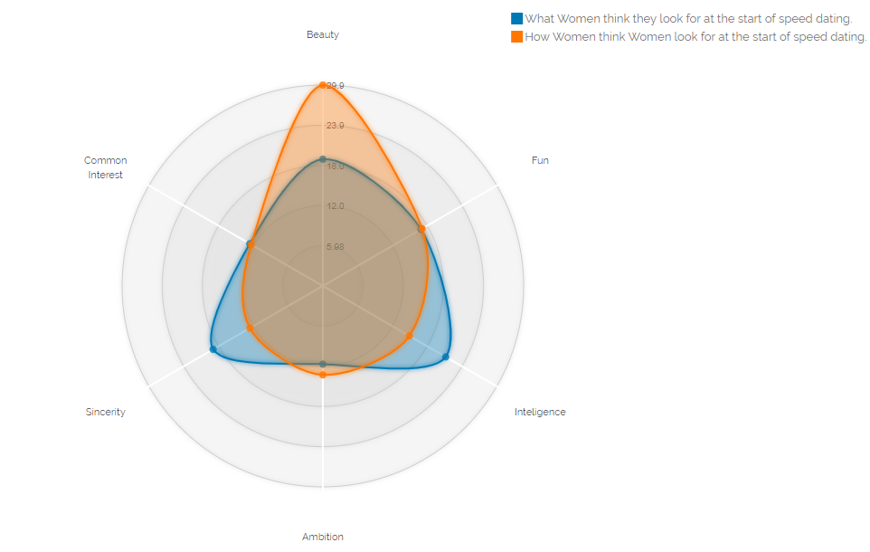
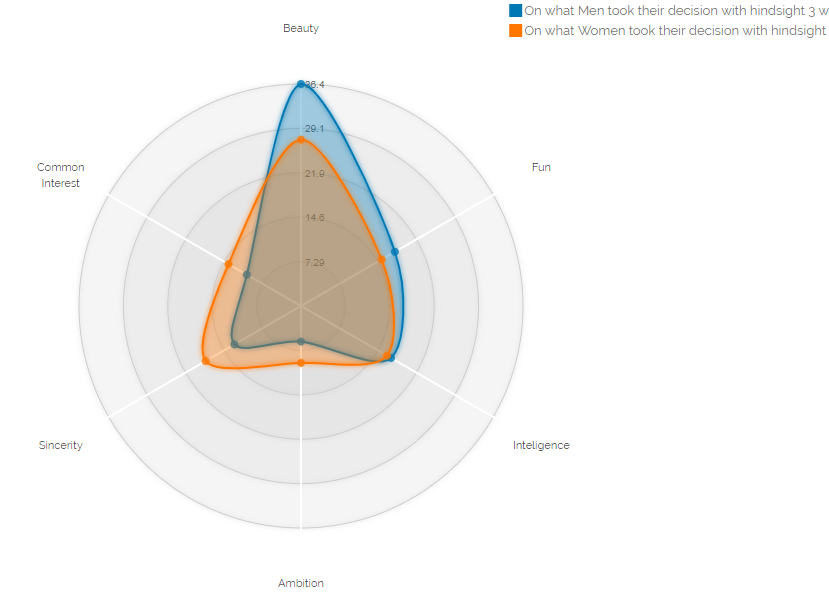

# speed_dating_vizualizaitions
How people think and base their jugement on during a speed dating : let's a spider graph explain all this to you.
See the github pages link: https://qdonnars.github.io/Speed-Dating-Visualization/

You will be able to compare how womens thinks they are basing their judgement on and they think others womens do during a speed dating.

Or how in retrospect mens and womens atributes of choice are diverging.

## Lounch the server : 
In order to lounch the server we recomand to use a http python one. Run the following command in the main (speed_dating_vizualisation) directory : 
~~~~
python3 -m http.server 8000
~~~~
You will then be able to acces the visalization on your browser http://localhost:8000/

Credits : this is a simple application of the complex code of the D3 library : http://bl.ocks.org/nbremer/21746a9668ffdf6d8242
Data source : https://www.kaggle.com/annavictoria/speed-dating-experiment
